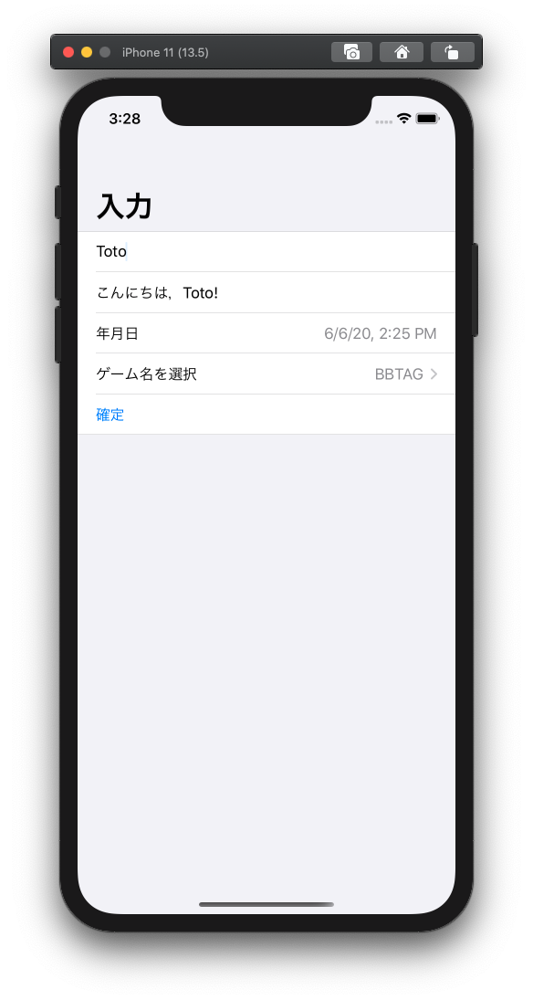
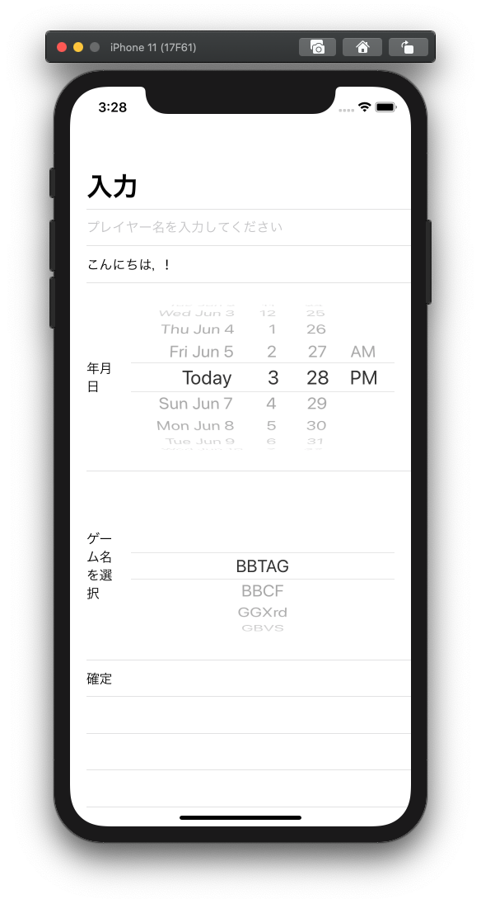

# FormSample

## FormとList

FormとListでの画面の表示の違いは以下

Listでの表示を行うより，Formで行ったほうがコンパクトになっていて見やすいかも...??  
選択する項目が少ないのであればListでも良さそう  
逆に選択項目が多い場合はFormを使用したほうがコンパクトで見やすい

FormもListもSectionで区切ることで入力を分割できる．  

## Modal表示

Modalで表示された画面を下にスワイプするか閉じるボタンを押すこと(別に実装する必要あり)で閉じる事が可能  
チュートリアルみたいなものでスワイプで閉じるようにすればボタン配置しない分広く使える

Dismissで画面に戻ってきたことは確認が可能  
Modalでのデータの更新をそこで確認してViewの更新などできるかも
