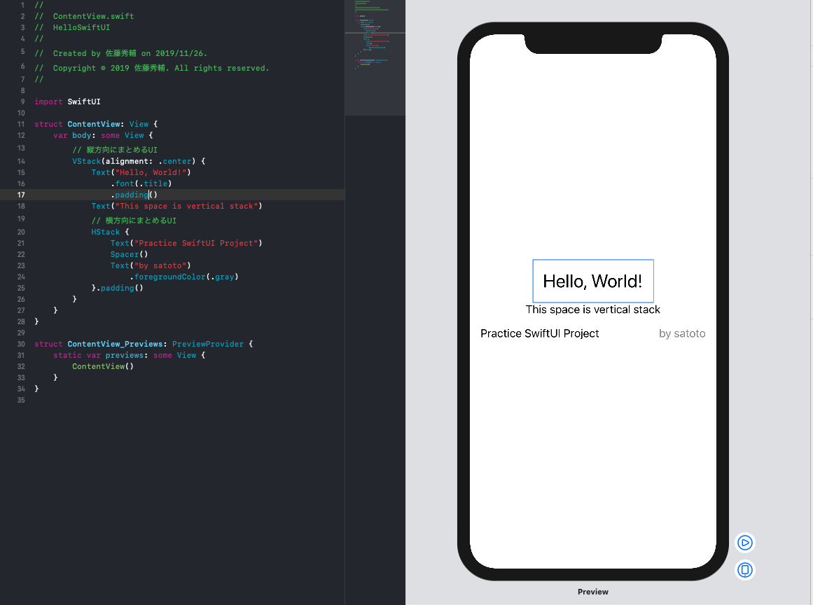

# Hello SwiftUI

## 初めてのSwiftUI

SwiftUIで初めてプロジェクトを作成した場合下図のようなUIで作成がされる．  
このとき，コード側でUIを変更しても，プレビュー側でUIの変更をしてもリアルタイムでコード，プレビューに反映される．  

Storyboardなどで使うオートレイアウトのような機能はないが，"VStack"，"HStack"という，縦軸，横軸を基準としてViewを並べるレイアウトが用意されている．  
(気持ち的にはAndroidなどのUI作成に近い...??)

これらは入れ子にして使うことができ，きれいに配置を行うことができる．

今回はテキストのみでこれらのViewを作成してみたが，画像なども同じ要領できれいに配置などをすることができそう．